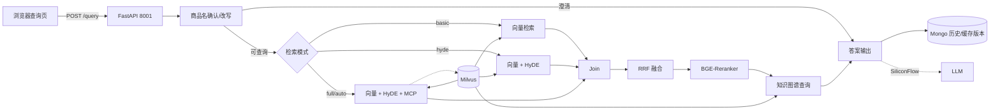
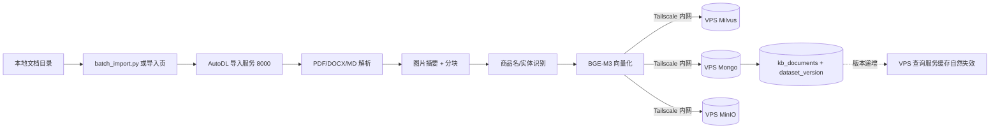

# 掌柜智库求职版

一个可验证、可解释、可展示的 RAG 知识库问答系统：支持 PDF / Markdown / DOCX 导入，查询时先确认商品名，再按需执行向量检索、HyDE、MCP 网络搜索、RRF 融合、Rerank 重排、知识图谱补充，最终生成带来源、商品名和实体的结构化答案。

## 一、最小启动路径（约 10 分钟）

前置条件：Python 3.12+、Docker Compose、已准备好的 BGE-M3 与 BGE-Reranker 权重。

```powershell
Copy-Item .env.example .env
# 必填：OPENAI_API_KEY、BGE_M3_PATH、BGE_RERANKER_LARGE；PDF 导入再填 MINERU_MODEL_SOURCE
docker compose -p zhihui-wenda-system up -d
.venv\Scripts\python.exe -m uvicorn knowledge.api.import_router:app --port 8000
.venv\Scripts\python.exe -m uvicorn knowledge.api.query_router:app --port 8001
```

- 导入页：http://localhost:8000/
- 查询页：http://localhost:8001/
- 环境变量、模型路径和调优参数见 `.env.example`，完整部署见 `DEPLOY.md`。

## 二、核心架构

| 模块 | 选型 |
|---|---|
| API | FastAPI + Uvicorn，导入服务 8000，查询服务 8001 |
| 工作流 | LangGraph 导入图 + 查询图 |
| 检索 | BGE-M3 稠密 + 稀疏混合向量；HyDE 假设文档；MCP WebSearch |
| 融合排序 | RRF 融合 + BGE-Reranker 断崖截断 |
| 存储 | Milvus（向量）、MongoDB（任务/历史/注册表/版本）、MinIO（图片） |
| 生成 | SiliconFlow OpenAI 兼容 API，JSON 失败自动回退 |
| 观测 | loguru 日志、`/health`、`/ready`、节点耗时、数据集版本化缓存 |

### VPS 查询链路



### AutoDL 手动导入链路



### 检索模式

`RETRIEVAL_MODE` 默认 `full`，保持完整链路。`basic` 只跑向量检索，`hyde` 跑向量 + HyDE，`auto` 先向量检索、无可用结果时单次扩展；非法配置在加载时直接报错。

## 三、面试演示路径

1. 上传一个 Markdown 文档，用 `/status/{task_id}` 观察导入任务进度、节点耗时和失败原因。
2. 上传相同内容的另一个文件名，返回 409；同名但内容不同的文件允许重新导入，旧记录自动标记 superseded。
3. 发起一次查询，展示 `source_refs`、`item_names`、`related_entities`，说明来源可追溯到 Milvus 切片。
4. 连续查同一个问题，展示缓存命中后延迟从几十秒降到秒级；导入或删除后 `dataset_version` 递增，旧缓存自然失效。
5. 切换 `RETRIEVAL_MODE=basic` 与 `full`，用日志里的节点耗时解释“按需检索”的取舍。
6. 打开 `/health` 与 `/ready`，解释 liveness/readiness 与模型状态探针的区别。

## 四、评估方法与报告入口

评估集位于 `eval/golden.jsonl`，33 条真实业务场景用例，覆盖本地问答、历史追问、歧义、拒答、图片和降级场景，不使用合成报告。

```powershell
.venv\Scripts\python.exe eval/run_eval.py --repeat 2 --output eval/reports/eval_report.json
```

报告包含 `case_count`、Top-1/Top-3 recall、faithfulness、citation completeness、P95 latency、cache hit rate 和分场景指标。当前测试基线为全量 95/95 单元测试通过：

```powershell
.venv\Scripts\python.exe -m unittest discover -s tests -t .
```

## 五、技术取舍

| 问题 | 结论 |
|---|---|
| 为什么不用 Celery/Redis 队列？ | 本项目 QPS 预计低于 5，FastAPI 后台任务 + SSE 已满足演示和生产低频场景；引入消息队列会增加 worker、序列化与运维成本。 |
| 为什么导入不用自动 GPU 调度？ | 导入低频且人工触发，AutoDL 手动开机跑导入是成本与复杂度最优解，不做自动伸缩。 |
| 为什么查询留在 CPU？ | 查询以本地检索为主，CPU 推理可接受；GPU 常驻开销远高于收益。 |
| 为什么不上 Prometheus/Grafana？ | 日志 + `/health` + `/ready` + 节点耗时 + 缓存/版本字段已能支撑面试讲解和问题定位；后续确有指标需求再补。 |
| 备份做到什么程度？ | 已有 `deploy/scripts/backup.sh` 思路：每日停服卷备份 + 每 6 小时 mongodump；不做生产级自动备份恢复演练，避免虚假承诺。 |

## 六、文档入口

- `DEPLOY.md`：裸进程、容器化、鉴权、健康检查和批量导入。
- `PROJECT_STATUS.md`：收敛计划、每轮改动、验证结果和问题记录。
- `eval/reports/eval_report.json`：真实评估报告入口（服务可用后生成）。
